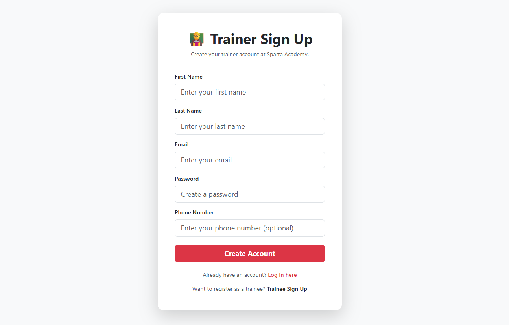
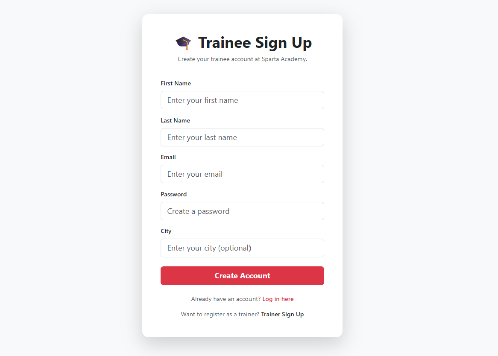
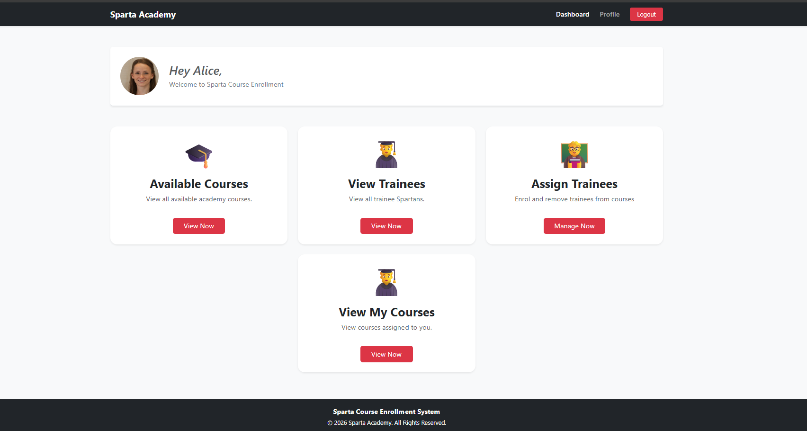
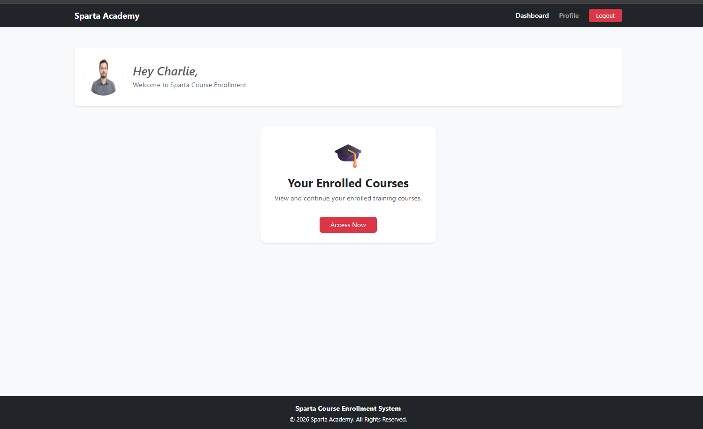
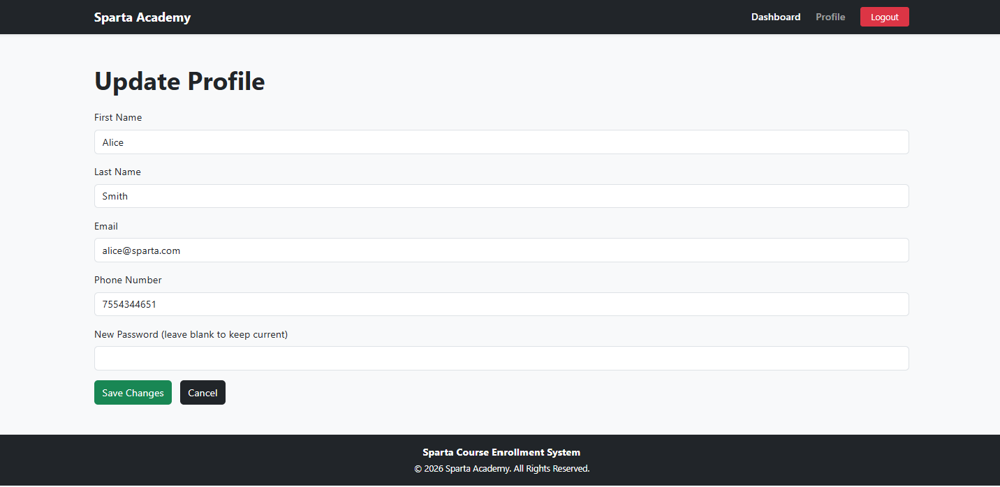

# Sparta Academy REST API

## Project Overview

Sparta Academy is a full-stack web application built with Spring Boot, Thymeleaf and secured with Spring Security.

The application manages:
- **Trainers** - can create and manage courses, view and manage trainees, and update their profile
- **Trainees** - can view their enrolled courses and update their profile
- **Courses** - can be created, updated, and trainees can be enrolled

---

## Technologies Used

- Java
- Spring Boot
- Spring MVC (Thymeleaf frontend)
- Spring Security
- Spring Data JPA
- Hibernate
- MySQL
- Maven
- Swagger / OpenAPI
- JUnit
- Mockito
- Bootstrap 5

---

# Database Design

## Tables

### Trainers

| Column         | Type         |
|----------------|--------------|
| trainer_id     | INT (PK)     |
| first_name     | VARCHAR      |
| last_name      | VARCHAR      |
| email          | VARCHAR      |
| specialisation | VARCHAR      |
| phone_number   | VARCHAR      |
| courses        | VARCHAR (FK) |

---

### Trainees

| Column        | Type     |
|---------------| -------- |
| trainee_id    | INT (PK) |
| first_name    | VARCHAR  |
| last_name     | VARCHAR  |
| email         | VARCHAR  |
| city          | VARCHAR  |
| course_id     | INT (FK) |

---

### Courses

| Column             | Type     |
|--------------------|----------|
| course_id          | INT (PK) |
| course_name        | VARCHAR  |
| course_description | VARCHAR  |
| start_date         | DATE     |
| end_date           | DATE     |
| max_students       | INT      |
| trainer_id         | INT (FK) |
| trainee_id         | INT (FK) |


### course_trainer (Join Table)
| Column     | Type     |
|------------|----------|
| course_id  | INT (FK) |
| trainer_id | INT (FK) |
---

## Relationships

- One Trainer can teach many Courses (ManyToMany via course_trainer join table)
- One Course can have many Trainees (OneToMany)
- One Trainee belongs to one Course (ManyToOne)

---

## Security

The application uses Spring Security with email/password authentication.

- Passwords are hashed using **BCrypt** — plain text passwords are never stored
- Both `Trainer` and `Trainee` entities implement `UserDetails`
- A `CustomUserDetailsService` checks the trainers table first, then the trainees table on login
- After login, users are redirected to their role-specific dashboard automatically

---


## Role-based Access

| Role    | Access                                                        |
|---------|---------------------------------------------------------------|
| TRAINER | Full access — manage courses, trainees, trainers, own profile |
| TRAINEE | View enrolled courses, update own profile                     |
 
---

# Project Structure

```text
src/main/java/com/sparta/spartaacademy
│
├── controllers
├── dto
├── entities
├── repositories
├── services
└── SpartaAcademyApplication.java
```

---

# Setup Instructions

## 1. Clone Repository

```bash
git clone https://github.com/AishwaryaGitay/sparta-academy.git
```

---

## 2. Configure MySQL


Make sure MySQL is running on your machine.

The database will be created automatically by Spring Boot using the `createDatabaseIfNotExist=true` setting in `application.properties`.

## 3. Configure application.properties

`application.properties` is gitignored so each developer manages their own DB credentials. Copy the template and fill in your details:

```bash
cp SpartaAcademy/src/main/resources/application.properties.example SpartaAcademy/src/main/resources/application.properties
```

Then open the new `application.properties` and replace `YOUR_DB_USERNAME` / `YOUR_DB_PASSWORD` with your local MySQL credentials.

---

## 4. Run Application

Run:

```bash
mvn spring-boot:run
```

or run `SpartaAcademyApplication.java` directly from IntelliJ.

---

# Swagger Documentation

Swagger UI:

```text
http://localhost:8091/swagger-ui.html
```

OpenAPI Docs:

```text
http://localhost:8091/v3/api-docs
```

---

# Testing

The project includes:

* Unit testing using JUnit
* Service layer testing using Mockito

Run tests using:

```bash
mvn test
```
Run a specific test class:

```bash
mvn test -Dtest=CourseServiceTest
```

---


# Screenshots

### Login Page


### Trainer Signup Page


### Trainee Signup Page


### Trainer Dashboard


### Trainee Dashboard


### Update Trainer profile
